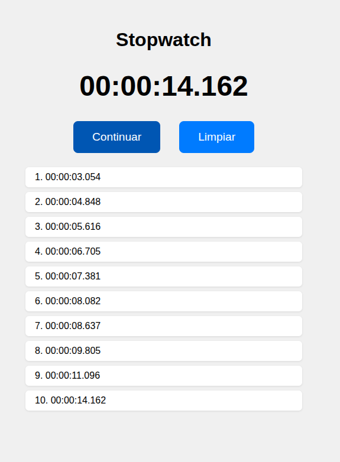

# 🕒 Aplicación de Cronómetro Web

Esta aplicación web implementa un cronómetro funcional con características como iniciar, pausar, continuar, limpiar y registrar tiempos intermedios.

## 📋 Características

- Visualización en formato `HH:MM:SS.mmm`
- Botón de control con estados: `Iniciar`, `Pausar`, `Continuar`
- Botón para `Limpiar` que reinicia todo
- Registro de tiempos al presionar `Pausar`
- Lista numerada con los tiempos pausados
- Diseño responsivo y accesible
- Alineado en la parte superior de la pantalla

## 🧑‍💻 Estructura de Archivos

/
├── index.html # Estructura de la interfaz
├── styles.css # Estilos de la aplicación
└── script.js # Lógica del cronómetro

## ▶️ Cómo Usar

1. **Abrir la aplicación** en un navegador moderno.
2. Presionar el botón `Iniciar` para comenzar el cronómetro.
3. Presionar `Pausar` para detener temporalmente el conteo y registrar el tiempo actual en una lista.
4. Presionar `Continuar` para reanudar desde donde se pausó.
5. Presionar `Limpiar` para reiniciar el cronómetro y limpiar la lista de tiempos.

## 📑 Formato de Tiempo

El cronómetro muestra el tiempo en este formato:

HH:MM:SS.mmm

- `HH` = Horas
- `MM` = Minutos
- `SS` = Segundos
- `mmm` = Milisegundos

## ♿ Accesibilidad

- Todos los botones incluyen atributos `aria-label`.
- Compatible con lectores de pantalla.
- Diseño claro con contraste alto y botones grandes para interacción táctil.

## 🧪 Requisitos

- Compatible con cualquier navegador moderno (Chrome, Firefox, Edge, Safari).
- No requiere instalación ni backend.

## 📷 Vista Previa

